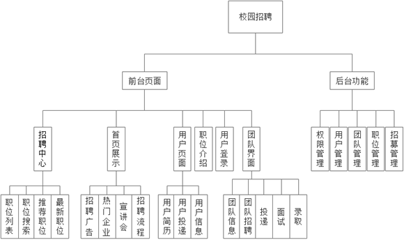

# 校园招聘

### 视频演示
[B站视频]：https://www.bilibili.com/video/BV1qp4y1K78D/?spm_id_from=333.999.0.0

### 介绍
#### 核心技术
- 选用发送邮件来实现用户和团队公司之间进行交互，使用户能够及时获取通知消息
- 使用redis来进行缓存导航职位菜单，提高系统性能
- 拥有招聘的一整套流程，包括：用户投简历->团队公司收到简历，进行筛选->面试用户->收到录取结果。每一个步骤都具有可控性和自定义性
#### 系统功能模块

#### ER图

